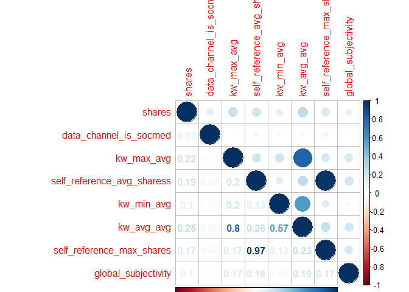

ST 558 Project 2
================
Sarah McLaughlin
6/22/2020

# Introduction

The data that will be used in this project is from the *Online News
Popularity Data Set* from the *UCI Machine Learning Repository*. The
goal of this project is to create two models (one a linear model, the
other an ensemble model) that will be used to predict the number of
shares/the probability/if an article has more than 1400 shares. How I
picked which variables is detailed below.

The data is from Mashable (www.mashable.com) and contains the statistics
for articles that were written and published on their website. There are
statistics for 39,645 articles.

In this project, I will attempt to create a linear regression model for
the data, comparing the Adjusted R Squared values of the models. Due to
the very low Adjusted R Squared models, I will instead move to a
logistic model. These models produce very small RMSEs.

I will also fit a Random Forest Classification model to the data. I have
attempted a few different Random Forest Models but due to computing
speed, have only included two models.

# Data

Here, I will bring in the data that will be used in this project. With
the data, we are trying to predict the number of shares a particular
article will receive.

## Read in data

``` r
data <- read_csv("OnlineNewsPopularity.csv")
```

    ## Parsed with column specification:
    ## cols(
    ##   .default = col_double(),
    ##   url = col_character()
    ## )

    ## See spec(...) for full column specifications.

``` r
#Look at column names  
attributes(data)$names
```

    ##  [1] "url"                           "timedelta"                    
    ##  [3] "n_tokens_title"                "n_tokens_content"             
    ##  [5] "n_unique_tokens"               "n_non_stop_words"             
    ##  [7] "n_non_stop_unique_tokens"      "num_hrefs"                    
    ##  [9] "num_self_hrefs"                "num_imgs"                     
    ## [11] "num_videos"                    "average_token_length"         
    ## [13] "num_keywords"                  "data_channel_is_lifestyle"    
    ## [15] "data_channel_is_entertainment" "data_channel_is_bus"          
    ## [17] "data_channel_is_socmed"        "data_channel_is_tech"         
    ## [19] "data_channel_is_world"         "kw_min_min"                   
    ## [21] "kw_max_min"                    "kw_avg_min"                   
    ## [23] "kw_min_max"                    "kw_max_max"                   
    ## [25] "kw_avg_max"                    "kw_min_avg"                   
    ## [27] "kw_max_avg"                    "kw_avg_avg"                   
    ## [29] "self_reference_min_shares"     "self_reference_max_shares"    
    ## [31] "self_reference_avg_sharess"    "weekday_is_monday"            
    ## [33] "weekday_is_tuesday"            "weekday_is_wednesday"         
    ## [35] "weekday_is_thursday"           "weekday_is_friday"            
    ## [37] "weekday_is_saturday"           "weekday_is_sunday"            
    ## [39] "is_weekend"                    "LDA_00"                       
    ## [41] "LDA_01"                        "LDA_02"                       
    ## [43] "LDA_03"                        "LDA_04"                       
    ## [45] "global_subjectivity"           "global_sentiment_polarity"    
    ## [47] "global_rate_positive_words"    "global_rate_negative_words"   
    ## [49] "rate_positive_words"           "rate_negative_words"          
    ## [51] "avg_positive_polarity"         "min_positive_polarity"        
    ## [53] "max_positive_polarity"         "avg_negative_polarity"        
    ## [55] "min_negative_polarity"         "max_negative_polarity"        
    ## [57] "title_subjectivity"            "title_sentiment_polarity"     
    ## [59] "abs_title_subjectivity"        "abs_title_sentiment_polarity" 
    ## [61] "shares"

## Exploratory Data Analysis

Here, I will do a basic analysis of my variables to see basic trends,
and correlations.

*Correlation of all Variables*

``` r
data <- data %>% select(-url)

correlation <- cor(data, method = "spearman")
```

Take only those with a correlation to shares of \> 0.10.

``` r
shareCor <- correlation[60, ] >= 0.1

corMax <- correlation[60, shareCor]

corMax
```

    ##     data_channel_is_socmed                 kw_min_avg 
    ##                  0.1135715                  0.1032421 
    ##                 kw_max_avg                 kw_avg_avg 
    ##                  0.2232914                  0.2556222 
    ##  self_reference_min_shares  self_reference_max_shares 
    ##                  0.1815168                  0.1687247 
    ## self_reference_avg_sharess        weekday_is_saturday 
    ##                  0.1921745                  0.1088596 
    ##                 is_weekend        global_subjectivity 
    ##                  0.1517175                  0.1135482 
    ##                     shares 
    ##                  1.0000000

Based on correlation values, these variables of note that will be used
in our analysis and prediction:

1.  shares
      - (target variable)  
2.  weekday\_is\_ variables
      - (weekday published)  
3.  data\_channel\_is\_socmed
      - (social media article)  
4.  kw\_max\_avg
      - (average keywords for the maximum shares)  
5.  self\_reference\_minimum\_sharess
      - (minimum shares of referenced articles)  
6.  is\_weekend
      - (published on a weekend)  
7.  kw\_min\_avg
      - (average keywords for minimum shares)  
8.  kw\_avg\_avg
      - (average keywords for average shares)  
9.  self\_reference\_max\_shares
      - (average shares of referenced articles )
10. global\_subjectivity
      - (text subjectivity)

## Select only needed variables from data for specific day

``` r
day1 <-paste0("weekday_is_", params$day)

day <- as.name(day1)

data <- data %>% 
  filter(eval(day) == 1) %>% 
  #select only needed variables. is_weekend not included
  select(shares, data_channel_is_socmed, kw_max_avg, self_reference_avg_sharess, kw_min_avg, 
         kw_avg_avg, self_reference_max_shares, global_subjectivity) %>% 
  collect()
```

## Create CorrPlot of all variables

``` r
corr <- cor(select(data, everything()), method = "spearman")

corrplot(corr, type = "upper", tl.pos = "lt")
corrplot(corr, type = "lower", method = "number", add = TRUE, diag = FALSE, tl.pos = "n")
```

<!-- -->

### Analysis

There is a strong correlation between kw\_avg\_avg and kw\_max\_avg, as
well as self\_reference\_max\_shares and self\_reference\_avg\_shares. I
may include these as interactions effects.

## Make Train and Test Set

``` r
# set seed
set.seed(130)
# Set indices
train <- sample(1:nrow(data), size =nrow(data)*0.7)
test <- setdiff(1:nrow(data), train)

# Make Train and Test Sets  

dataTrain <- data[train, ]
dataTest <- data[test, ]
```

**Run Quick Summaries on Train Data**

``` r
summary(dataTrain)
```

    ##      shares       data_channel_is_socmed   kw_max_avg    
    ##  Min.   :    42   Min.   :0.00000        Min.   :  2019  
    ##  1st Qu.:   904   1st Qu.:0.00000        1st Qu.:  3524  
    ##  Median :  1300   Median :0.00000        Median :  4255  
    ##  Mean   :  3298   Mean   :0.06109        Mean   :  5554  
    ##  3rd Qu.:  2500   3rd Qu.:0.00000        3rd Qu.:  5991  
    ##  Max.   :441000   Max.   :1.00000        Max.   :139600  
    ##  self_reference_avg_sharess   kw_min_avg       kw_avg_avg     
    ##  Min.   :     0             Min.   :  -1.0   Min.   :  713.9  
    ##  1st Qu.:   993             1st Qu.:   0.0   1st Qu.: 2344.4  
    ##  Median :  2300             Median : 986.6   Median : 2836.5  
    ##  Mean   :  5952             Mean   :1103.1   Mean   : 3114.4  
    ##  3rd Qu.:  5300             3rd Qu.:2047.4   3rd Qu.: 3555.1  
    ##  Max.   :663600             Max.   :3609.7   Max.   :27391.6  
    ##  self_reference_max_shares global_subjectivity
    ##  Min.   :     0            Min.   :0.0000     
    ##  1st Qu.:  1100            1st Qu.:0.3952     
    ##  Median :  2900            Median :0.4517     
    ##  Mean   :  9639            Mean   :0.4402     
    ##  3rd Qu.:  8200            3rd Qu.:0.5051     
    ##  Max.   :843300            Max.   :1.0000

As will be used later, the median number of shares for an article is
1400. From the summaries, you can tell which variables are indicator
variables (those with a min of 0 and max of 1;
i.e. `data_channel_is_socmed` and `global_subjectivity`.) This also
shows that the data will need to be standardized when I use the ensemble
method.

Overall, the data is quite varied (especially the average variables).
You can see that the `shares` data and `self_reference_avg_share` data
have the same range.

## Compare Fit Stats Function to compare models

``` r
compareFitStats <- function(fit1, fit2){
  require(MuMIn)
  fitStats <- data.frame(fitStat = c("Adj R Square", "AIC", "AICc", "BIC"), 
              col1 = round(c(summary(fit1)$adj.r.squared, AIC(fit1), 
                             MuMIn::AICc(fit1), BIC(fit1)), 3), 
              col2 = round(c(summary(fit2)$adj.r.squared, AIC(fit2), 
                             MuMIn::AICc(fit2), BIC(fit2)), 3))
  
  #put names on returned df  
  calls <- as.list(match.call())
  calls[[1]] <- NULL
  names(fitStats[2:3])<- unlist(calls)
  fitStats
}
```

# Linear Regression Model

I will begin by running a regression model with all of the variables.

**allVarFit**

``` r
allVarFit <- lm(shares ~., data = dataTrain)

allVarFit
```

    ## 
    ## Call:
    ## lm(formula = shares ~ ., data = dataTrain)
    ## 
    ## Coefficients:
    ##                (Intercept)      data_channel_is_socmed  
    ##                 -2.342e+03                   4.075e+02  
    ##                 kw_max_avg  self_reference_avg_sharess  
    ##                 -2.850e-01                   4.514e-02  
    ##                 kw_min_avg                  kw_avg_avg  
    ##                 -6.838e-01                   2.458e+00  
    ##  self_reference_max_shares         global_subjectivity  
    ##                 -1.771e-02                   4.506e+02

Then, I will create another linear model with the interaction effects to
see if it makes a difference.

**intLM**

``` r
intLM <- lm(shares ~ data_channel_is_socmed + 
                  kw_max_avg + kw_min_avg +
                  self_reference_avg_sharess +
                  kw_avg_avg +
                  self_reference_max_shares +
                  global_subjectivity + 
                  kw_avg_avg:kw_max_avg + 
                  self_reference_max_shares:self_reference_avg_sharess, 
                data = dataTrain
)

intLM
```

    ## 
    ## Call:
    ## lm(formula = shares ~ data_channel_is_socmed + kw_max_avg + kw_min_avg + 
    ##     self_reference_avg_sharess + kw_avg_avg + self_reference_max_shares + 
    ##     global_subjectivity + kw_avg_avg:kw_max_avg + self_reference_max_shares:self_reference_avg_sharess, 
    ##     data = dataTrain)
    ## 
    ## Coefficients:
    ##                                          (Intercept)  
    ##                                           -2.357e+03  
    ##                               data_channel_is_socmed  
    ##                                            2.757e+02  
    ##                                           kw_max_avg  
    ##                                           -1.549e-01  
    ##                                           kw_min_avg  
    ##                                           -6.333e-01  
    ##                           self_reference_avg_sharess  
    ##                                            7.030e-02  
    ##                                           kw_avg_avg  
    ##                                            2.274e+00  
    ##                            self_reference_max_shares  
    ##                                           -8.628e-04  
    ##                                  global_subjectivity  
    ##                                           -9.871e+01  
    ##                                kw_max_avg:kw_avg_avg  
    ##                                           -8.316e-06  
    ## self_reference_avg_sharess:self_reference_max_shares  
    ##                                           -1.033e-07

## Comparison of Two Models

I will compare the two models using the compareFitStats function.

``` r
compareFitStats(allVarFit, intLM)
```

    ##        fitStat       col1       col2
    ## 1 Adj R Square      0.026      0.029
    ## 2          AIC 110645.441 110631.413
    ## 3         AICc 110645.475 110631.464
    ## 4          BIC 110704.401 110703.476

### Analysis

Neither model fits the data well. I am going to try a logistic
regression model instead.

# Logistic Model

First, I need to create a logical variable to reference whether the
number of shares is less than 1400 or greater than 1400. I am still
going to use the same variables as those in my linear regression
attempt.

``` r
data1 <- data %>% mutate(logShares = ifelse(shares >= 1400, 1, 0)) 
data1 <- data1 %>% select(logShares, everything()) %>% select(-shares)

#Create New Test and Train Set with logShares Variable. Set seed gives same train and test set. 

# set seed
set.seed(130)
# Set indices
train <- sample(1:nrow(data1), size =nrow(data1)*0.7)
test <- setdiff(1:nrow(data1), train)

# Make Train and Test Sets  

data1Train <- data1[train, ]
data1Test <- data1[test, ]

data1
```

    ## # A tibble: 7,390 x 8
    ##    logShares data_channel_is~ kw_max_avg self_reference_~ kw_min_avg kw_avg_avg
    ##        <dbl>            <dbl>      <dbl>            <dbl>      <dbl>      <dbl>
    ##  1         0                0      2019.            3100           0       804.
    ##  2         0                0      2019.               0           0       728.
    ##  3         1                0      2318.             727           0      1185.
    ##  4         0                0      2019.             951           0      1114.
    ##  5         0                0      2193.            1300           0       885.
    ##  6         0                0      2154.               0           0      1191.
    ##  7         1                0      2103.            3151.        480      1539.
    ##  8         1                0      4660.            2700           0      1400.
    ##  9         0                0      5700                0           0      1803.
    ## 10         1                0      2019.           20900           0       714.
    ## # ... with 7,380 more rows, and 2 more variables:
    ## #   self_reference_max_shares <dbl>, global_subjectivity <dbl>

Here, I will fit a logistic regression model using the `glm()` function
with the `"binomial"` family. I will look at how the removal of certain
variables changes the AIC value for each model.

**GLM ALL Model**

``` r
glmALL <- glm(logShares ~., data = data1Train, family = "binomial")

glmALL
```

    ## 
    ## Call:  glm(formula = logShares ~ ., family = "binomial", data = data1Train)
    ## 
    ## Coefficients:
    ##                (Intercept)      data_channel_is_socmed  
    ##                 -1.638e+00                   1.001e+00  
    ##                 kw_max_avg  self_reference_avg_sharess  
    ##                 -7.657e-05                   1.538e-05  
    ##                 kw_min_avg                  kw_avg_avg  
    ##                 -1.573e-04                   6.383e-04  
    ##  self_reference_max_shares         global_subjectivity  
    ##                 -4.919e-06                   3.520e-01  
    ## 
    ## Degrees of Freedom: 5172 Total (i.e. Null);  5165 Residual
    ## Null Deviance:       7171 
    ## Residual Deviance: 6850  AIC: 6866

I will remove `kw_avg_min` variable just to be able to compare fits of
the two logistic models.

**GLM All but One Model**

``` r
glmAllButOne <- glm(logShares ~ data_channel_is_socmed + 
                  kw_max_avg + 
                  self_reference_avg_sharess +
                  kw_avg_avg +
                  self_reference_max_shares +
                  global_subjectivity, 
                data = data1Train, 
                family = "binomial"
)

glmAllButOne
```

    ## 
    ## Call:  glm(formula = logShares ~ data_channel_is_socmed + kw_max_avg + 
    ##     self_reference_avg_sharess + kw_avg_avg + self_reference_max_shares + 
    ##     global_subjectivity, family = "binomial", data = data1Train)
    ## 
    ## Coefficients:
    ##                (Intercept)      data_channel_is_socmed  
    ##                 -1.458e+00                   9.962e-01  
    ##                 kw_max_avg  self_reference_avg_sharess  
    ##                 -5.089e-05                   1.642e-05  
    ##                 kw_avg_avg   self_reference_max_shares  
    ##                  4.740e-04                  -5.281e-06  
    ##        global_subjectivity  
    ##                  3.809e-01  
    ## 
    ## Degrees of Freedom: 5172 Total (i.e. Null);  5166 Residual
    ## Null Deviance:       7171 
    ## Residual Deviance: 6871  AIC: 6885

### Analysis

The AIC for the glmAllButOne model is much higher than the all variable
model. I will remove another variable, `global_subjectivity` (next
smallest correlation) and see if that helps.

**glm All But Two Model**

``` r
glmAllButTwo <- glm(logShares ~ data_channel_is_socmed + 
                  kw_max_avg + 
                  self_reference_avg_sharess +
                  kw_avg_avg +
                  self_reference_max_shares, 
                data = data1Train, 
                family = "binomial"
)

glmAllButTwo
```

    ## 
    ## Call:  glm(formula = logShares ~ data_channel_is_socmed + kw_max_avg + 
    ##     self_reference_avg_sharess + kw_avg_avg + self_reference_max_shares, 
    ##     family = "binomial", data = data1Train)
    ## 
    ## Coefficients:
    ##                (Intercept)      data_channel_is_socmed  
    ##                 -1.293e+00                   1.000e+00  
    ##                 kw_max_avg  self_reference_avg_sharess  
    ##                 -5.071e-05                   1.688e-05  
    ##                 kw_avg_avg   self_reference_max_shares  
    ##                  4.737e-04                  -5.330e-06  
    ## 
    ## Degrees of Freedom: 5172 Total (i.e. Null);  5167 Residual
    ## Null Deviance:       7171 
    ## Residual Deviance: 6873  AIC: 6885

\#\#Analysis  
Remove `data_channel_is_socmed`.

**glm All But Three Model**

``` r
glmAllButThree <- glm(logShares ~ 
                  kw_max_avg + 
                  self_reference_avg_sharess +
                  kw_avg_avg +
                  self_reference_max_shares,
                data = data1Train, 
                family = "binomial"
)

glmAllButThree
```

    ## 
    ## Call:  glm(formula = logShares ~ kw_max_avg + self_reference_avg_sharess + 
    ##     kw_avg_avg + self_reference_max_shares, family = "binomial", 
    ##     data = data1Train)
    ## 
    ## Coefficients:
    ##                (Intercept)                  kw_max_avg  
    ##                 -1.255e+00                  -5.463e-05  
    ## self_reference_avg_sharess                  kw_avg_avg  
    ##                  1.605e-05                   4.858e-04  
    ##  self_reference_max_shares  
    ##                 -4.450e-06  
    ## 
    ## Degrees of Freedom: 5172 Total (i.e. Null);  5168 Residual
    ## Null Deviance:       7171 
    ## Residual Deviance: 6937  AIC: 6947

\#\#Analysis  
Remove `self_reference_max_shares`.

**glm All But Four Model**

``` r
glmAllButFour <- glm(logShares ~ 
                  kw_max_avg + 
                  self_reference_avg_sharess +
                  kw_avg_avg, 
                data = data1Train, 
                family = "binomial"
)
glmAllButFour
```

    ## 
    ## Call:  glm(formula = logShares ~ kw_max_avg + self_reference_avg_sharess + 
    ##     kw_avg_avg, family = "binomial", data = data1Train)
    ## 
    ## Coefficients:
    ##                (Intercept)                  kw_max_avg  
    ##                 -1.252e+00                  -5.453e-05  
    ## self_reference_avg_sharess                  kw_avg_avg  
    ##                  8.433e-06                   4.856e-04  
    ## 
    ## Degrees of Freedom: 5172 Total (i.e. Null);  5169 Residual
    ## Null Deviance:       7171 
    ## Residual Deviance: 6941  AIC: 6949

## Analysis

Did not help. Will keep `self_reference_max_shares`.

## Comparison of all Four Logistic Models

I will predict the test data and compare the RMSEs of those.

``` r
#Make predictions  
predALL <- predict(glmALL, newdata = data1Test, type = "link")
predALLbutOne <- predict(glmAllButOne, newdata = data1Test, type = "link")
predALLbutTwo <- predict(glmAllButTwo, newdata = data1Test, type = "link")
predALLbutThree <- predict(glmAllButThree, newdata = data1Test, type = "link")

#Calculate RMSE  
AllMSE <- rmse(data1Test$logShares, predALL)
OneMSE <- rmse(data1Test$logShares, predALLbutOne)
TwoMSE <- rmse(data1Test$logShares, predALLbutTwo)
ThreeMSE <- rmse(data1Test$logShares, predALLbutThree)

matMSE <- matrix(c(AllMSE, OneMSE, TwoMSE, ThreeMSE), nrow = 1, ncol = 4, byrow = TRUE)

matMSE
```

    ##           [,1]      [,2]      [,3]      [,4]
    ## [1,] 0.8399529 0.8395468 0.8429256 0.8239479

### Analysis

The glmAllButThree produces the smallest MSE. I will use this as my
model for the data. The glmAllButThree also produces the highest AIC
value.

# Ensemble Model

From the past homework assigment, it seems that each of the ensemble
methods that we covered are equally efficient. I am going to use the
Random Forest model to fit my data. Overall, Random Forest is better
than bagging and boosting trees take longer to do. I will add a class
variable (less than 1400, more than 1400) that I will predict on the
test data.

## Fix Train and Test Data

``` r
dataTrain <- dataTrain %>% mutate(group = ifelse(shares <= 1400, "less than 1400", "more than 1400")) %>%
  select(group, kw_max_avg, self_reference_avg_sharess, 
         kw_min_avg, kw_avg_avg, self_reference_max_shares, 
         global_subjectivity) %>% collect()

dataTrain$group <- as.factor(dataTrain$group)

dataTrain
```

    ## # A tibble: 5,173 x 7
    ##    group kw_max_avg self_reference_~ kw_min_avg kw_avg_avg self_reference_~
    ##    <fct>      <dbl>            <dbl>      <dbl>      <dbl>            <dbl>
    ##  1 more~      4650             1833.         0       2737.             3300
    ##  2 less~      3430.            1800       1005.      2582.             2400
    ##  3 less~      5386.               0          0       2923.                0
    ##  4 less~      7240.            2531       3524.      5502.             4100
    ##  5 more~      4000             6646.      1533.      3227.            53100
    ##  6 less~      4124.            1900          0       2696.             2100
    ##  7 less~      3954.            3400       2879.      3421.             5200
    ##  8 less~      3272.            6788.         0       1919.            23100
    ##  9 less~      4346.             876.      1295.      2857.              995
    ## 10 more~      7787.            3800       3484.      5258.             4100
    ## # ... with 5,163 more rows, and 1 more variable: global_subjectivity <dbl>

``` r
dataTest <- dataTest %>% mutate(group =ifelse(shares <= 1400, "less than 1400", "more than 1400")) %>%
  select(group, kw_max_avg, self_reference_avg_sharess, 
         kw_min_avg, kw_avg_avg, self_reference_max_shares, 
         global_subjectivity) %>% collect()

dataTest$group <- as.factor(dataTest$group)
```

**Random Forest Model**

``` r
# train control parameters  
trctrl <- trainControl(method = "repeatedcv", number = 10, repeats = 3)

rfFit<- train(group~., data = dataTrain, method = "rf", trControl = trctrl, preProcess = c("center", "scale"))
```

**Predict Data with rfFit**

``` r
rfPred <- predict(rfFit, select(dataTest, -"group"))
```

**Compare Predictions to Actual**

``` r
fullTbl <- table(data.frame(rfPred, dataTest$group))

fullTbl
```

    ##                 dataTest.group
    ## rfPred           less than 1400 more than 1400
    ##   less than 1400            812            514
    ##   more than 1400            398            493

**Find MisClassification Rate**

``` r
rfMis <- 1 - sum(diag(fullTbl)/sum(fullTbl))

rfMis
```

    ## [1] 0.4113667

### Analysis

This a pretty large misclassification rate. I will choose less variables
to see if it helps.

**One Variable Random Forest**

``` r
# no kw_min_avg, has lowest correlation 
rf1 <- train(group ~ kw_max_avg + self_reference_avg_sharess +  
         + kw_avg_avg + self_reference_max_shares +  
         global_subjectivity, data = dataTrain, method = "rf", trControl = trctrl, preProcess = c("center", "scale"))  
```

**Predict Data with rf1**

``` r
rf1Pred <- predict(rf1, select(dataTest, -"group"))  
```

**Compare Predictions to Actual**

``` r
fullTbl <- table(data.frame(rf1Pred, dataTest$group))  

fullTbl
```

    ##                 dataTest.group
    ## rf1Pred          less than 1400 more than 1400
    ##   less than 1400            812            526
    ##   more than 1400            398            481

**Find MisClassification Rate**

``` r
rfMis <- 1 - sum(diag(fullTbl)/sum(fullTbl))

rfMis
```

    ## [1] 0.4167794

### Analysis

This does not help. I will keep my first Random Forest Model for
prediction.

# Models Used

Overall, I have chosen the following models for my data.

1.  glmAllbutThree: Logistic Regression Model  
2.  rfFit : Random Forest Model
